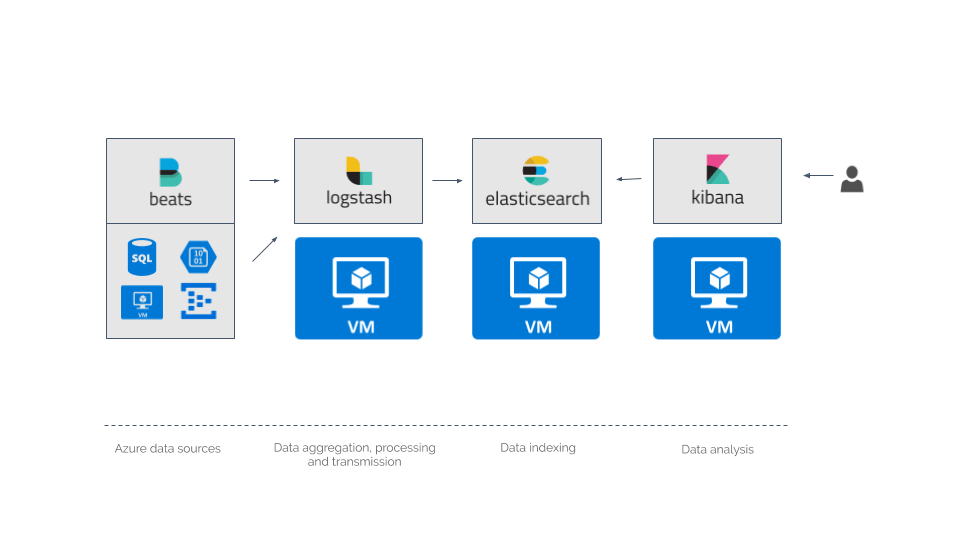

## Centralized Logging Architecture

#### 1. Main aspects to address
#### 1.1 Collection
 - syslog
 - log files in `/var/log`
 - application specific logs in home directories or other locations
 - webserver access/error logs
 - database and caching server logs
 
#### 1.2 Transport
Log data can accumulate quickly on multiple hosts. Transporting it reliably and quickly to your centralized location 
may need additional tooling in order to effectively transmit it and ensure data is not lost.

#### 1.3 Storage
Now that your log data is being transferred, it needs a destination. Your centralized storage system needs to be able to handle the growth in data over time. Each day will add a certain amount of storage that is relative to the number of hosts and processes that are generating log data.

*How you store things depends on a few things:* 

 - How long should it be stored
 - Your environments data volume
 - How will you need to access the logs (real-time or even batch analysis)

#### 1.4 Analysis
Once your logs are stored on a centralized storage platform, you need a way to analyze them.

#### 1.5 Alerting
The last component that is sometimes nice to have is the ability to alert on log patterns or calculated metrics based on log data.

#### 2. Principles of application logging

 - Always write the event stream, unbuffered to stdout
 - One line equals one log entry
 - Lines not matching the format might get dropped or not be accessible at all
 - On staging or production env, each process/services stdout stream will be captured by some daemonized service (Fluentd or beats) 
 within that execution environment, validate & transform it and route to one or more distributed system for viewing, analyzing and long-term archival.
 - Generate a **correlation ID(REQ_ID or TRACE_ID)** when you are making the first microservice call and pass that same ID to downstream services. 
 Log the correlation ID across all microservice calls. That way, we can use the correlation ID coming from the response to trace out the logs. 
   
#### 3. Application Log Entry Attributes

###### 3.1 Standard attributes:
* **EVENT_TIME** - ISO8601_TIMESTAMP
* **SEVERITY** or **LEVEL** - enum(DEBUG, INFO, WARN, ERROR, CRITICAL)
* **MESSAGE** or **EVENT** - String format
* **ENV** - enum(DEV, STAGING, UAT, PROD)
* **VERSION** - enum(V1, V2, 1.0.10, etc…)
* **SOURCE_FILE** - relative path of the source file
* **LINE_NO** - line number of the file where event triggered
* **RAW_DATA** - JSON stringified
* **REQ_URL** - string
* **REQ_ID** - string
* **TRACE_ID** - string
* **REQ_HEADERS** - JSON stringified
* **REQ_BODY** - JSON stringified
* **RES_HEADERS** - JSON stringified
* **RES_BODY** - JSON stringified
* **RES_STATUS_CODE** - enum(200, 201, 401 ..)

###### 3.2 Custom attributes:
* **USER_ID** - integer
* **USER_NAME** - string
* **ORDER_ID** - string

**Note** - If any of the field which is containing sensitive information like CC number, password etc. then we need to 
mask it before logging to meet the ***PCI compliance***

#### 4. Log Entry Format

 - Each process/service stdout log messages will be in some particular defined format.

**For example**:  

```
const logfmt = require('logfmt');

logfmt.log({ "foo": "bar", "a": 14, baz: 'hello kitty'});
//=> foo="bar" a=14 baz="hello kitty"
```

#### 5. ELK Stack Integration diagram



#### 6. Logging and monitoring tools
##### 6.1 Transport
`Scribe, Flume, Heka, Logstash, Chukwa, fluentd, nsq and Kafka`
    
##### 6.2 Storage
`AWS Cloudwatch, Datadog, Azure Log analytics, AWS S3, Cassandara, MongoDB, ElasticSearch, Hadoop`

##### 6.3 Analysis
`AWS Cloudwatch, Datadog, Azure Log analytics, ElasticSearch, Kibana, Graylog2`
 
##### 6.4 Alerting
`AWS Cloudwatch, Datadog, Sentry, HoneyBadger`

#### 7. SaaS-based logging, analyzing and monitoring tools
`Datadog, Stackify, Logzio, Graylog, Splunk, Logstash, Papertrail, Loggly etc.`